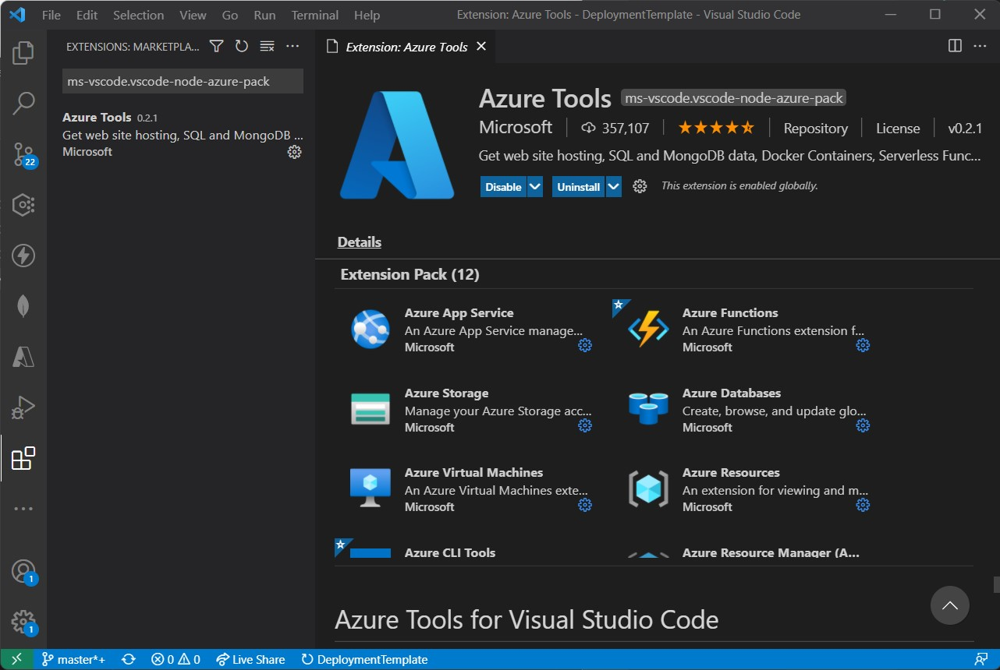
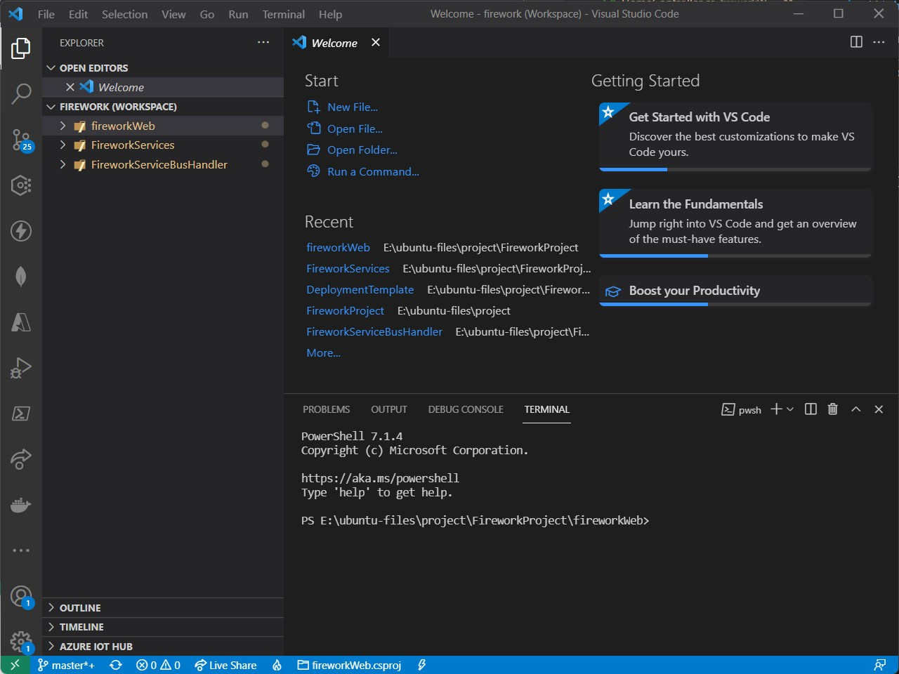
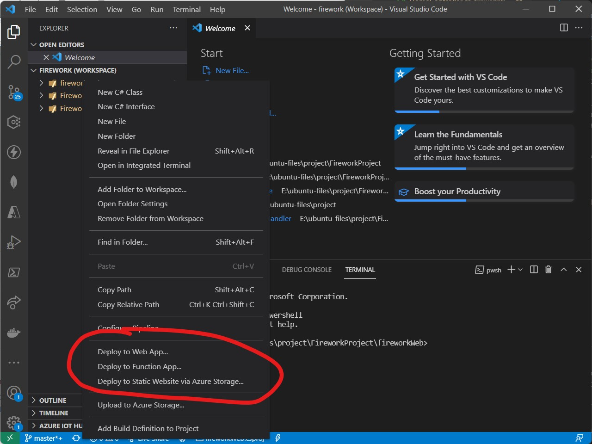

# **FireworkProject**

This is a source code from AzureBaseCamp series

## **Prerequisite**

* dotnet 5 SDK
* Visual Studio Code
* Azure Function / App Services VSCode Extension
* Azure subscription
* Azure CLI
* Terraform

## **Setup VSCode**

Open VSCode and go to Extensions tab or press **Ctrl + Shift + X**

Then Search for "**ms-vscode.vscode-node-azure-pack**" and install it !!



## **Setup terraform parameter**

Clone this repo first!

```bash
git clone https://github.com/veeravat/ABC-FireworkProject.git
```

Navigate to DeploymentTemplate Folder and open with VSCode

```bash
cd ./DeploymentTemplate
code .
```

Edit deployFirework terraform file with your parameter

* Name = Your project Name
* location = Azure region to deploy


## Deploy Azure Infrastucture

login to azure cli and deploy the terraform template

***This process may take up to 30 minute to complete**

```bash
#login to azure
az login

#If you have multiple subsciption please set the default one by using this command
az account set -s <subscript name or id>

#Deploy the terraform template
terraform init
terraform apply
```

## **Deploy the application**

Open the file **firework.code-workspace** by VSCode



Then right click each project and deploy to the resource that you deploy earlier by the detail below

| Project Name              | Deploy Type            | Target Name                              |
| ------------------------- | ---------------------- | ---------------------------------------- |
| fireworkWeb               | Deploy to Web App      | web-\<your-app-name\>-view-\<random id\> |
| fireworkServices          | Deploy to Web App      | web-\<your-app-name\>-api-\<random id\>  |
| FireworkServiceBusHandler | Deploy to Function App | fn-\<your-app-name\>-\<random id\>       |


